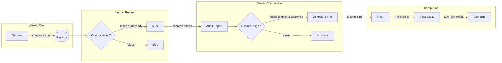
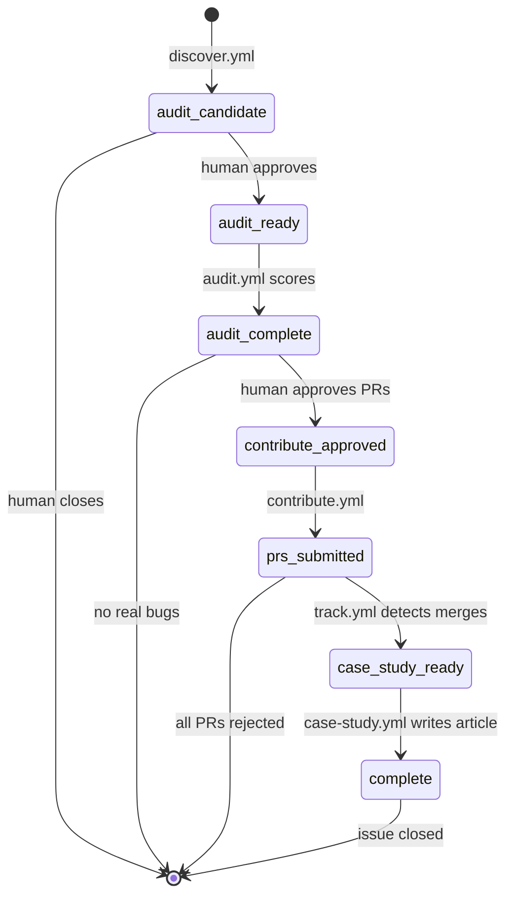

# nlpm-auditor

*A health inspector for the Claude Code ecosystem — making the rounds so the restaurants don't have to wonder about their own kitchens.*

Automated pipeline for discovering, auditing, and contributing to Claude Code plugin and skill repos across GitHub. Uses [NLPM](https://github.com/xiaolai/nlpm-for-claude) scoring (50 rules, 100-point scale) and [claude-code-action](https://github.com/anthropics/claude-code-action) for automated analysis.

## How It Works



## Pipeline

| Workflow | Trigger | What it does |
|----------|---------|-------------|
| `discover.yml` | Weekly cron / manual | Trawls GitHub for Claude Code repos with 500+ stars and 5+ NL artifacts — casting the net |
| `audit.yml` | Issue labeled `audit-ready` | Clones the repo and gives it a physical — NLPM scores every artifact, writes the diagnosis |
| `contribute.yml` | Issue labeled `contribute-approved` | Knocks on the maintainer's door with a fix — forks, branches, PRs for verified bugs only (max 5) |
| `track.yml` | Weekly cron | Checks the mailbox — did the maintainer merge, close, or ignore? Updates the registry |
| `case-study.yml` | Issue labeled `case-study-ready` | Writes up the story — gathers evidence, drafts article, polishes prose, paints the cover, commits the whole thing |
| `daily-report.yml` | Daily 22:00 UTC / manual | Takes the pulse — pipeline state, PR scorecard, rule frequency, rejection lessons, self-evolution signals |

## Issue Label Lifecycle



| Label | Meaning |
|-------|---------|
| `audit-candidate` | Discovered by crawler, awaiting human review |
| `audit-ready` | Approved for audit — triggers `audit.yml` |
| `audit-complete` | Audit report generated |
| `contribute-approved` | Human approved PR submission — triggers `contribute.yml` |
| `prs-submitted` | PRs have been submitted to the target repo |
| `case-study-ready` | PRs merged — triggers `case-study.yml` |
| `complete` | Case study published, issue closed |

## Case Study Generation

Every good audit deserves a good story. When `case-study-ready` is applied, the pipeline writes one:

1. **Gathers evidence** — like a journalist assembling source material before writing a word:
   - Repo metadata, all PRs (states, timestamps, URLs), tracking issues
   - Commits mentioning NLPM or Claude co-authorship
   - Maintainer review comments — what they said matters more than what we said
   - The original audit report

2. **Writes the draft** — claude-code-action follows a proven template (disclosure, audit results with mermaid charts, PRs submitted, maintainer response, timeline, limitations)

3. **Polishes the prose** — a second pass adds literary texture: similes, metaphors, punch lines. Restraint is elegance — 8-15 touches, no more

4. **Validates mermaid** — every diagram block is syntax-checked; broken ones get fixed automatically

5. **Paints the cover** — DALL-E generates an editorial illustration in warm amber and navy

6. **Commits the package** — article + image to `case-studies/`, registry updated, issue closed. The story tells itself from that point on.

## Rules of Engagement

We're guests in other people's repos. Behave accordingly.

1. **Only submit PRs for verified bugs** — the kind that break things, not the kind that offend your taste
2. **Never PR convention preferences** — if their YAML works, it's their YAML
3. **One tracking issue first** — introduce yourself before rearranging the furniture
4. **Max 5 PRs per repo** — a focused visit, not a renovation
5. **Max 2 repos per week** — good neighbors don't ring every doorbell on the street
6. **Accept "no" gracefully** — close the PR, say thank you, and take the lesson home

## Setup

1. Create the repo on GitHub
2. Add secrets:
   - `CLAUDE_CODE_OAUTH_TOKEN` — for claude-code-action
   - `PAT_TOKEN` — GitHub PAT with `public_repo` scope (for forking and PRing to other repos)
   - `OPENAI_API_KEY` — for DALL-E cover image generation
3. Create the issue labels listed above
4. Run `discover.yml` manually to seed the registry

## Directory Structure

```
registry/repos.json          — The patient file: every repo and where it is in the pipeline
audits/                      — The X-rays: per-repo scoring reports
case-studies/                — The published stories: date-prefixed articles
case-studies/images/         — Cover art: compressed, date-prefixed
reports/                     — Daily health checks: pipeline state + self-evolution signals
feedback/log.json            — The learning journal: rule stats, PR outcomes, rejection patterns
```

Naming: `YYYY-MM-DD-owner-name.md`, `YYYY-MM-DD-owner-name-cover.png`, `YYYY-MM-DD.md` (reports)

## Self-Evolution

The daily report tracks signals that should feed back into NLPM itself:

| Signal | What it means | Action |
|--------|--------------|--------|
| Rule fires 20+ times across audits | Might be noise, not signal | Review rule — is it finding real bugs or just being pedantic? |
| PR rejected by maintainer | NLPM flagged something the maintainer considers valid | Soften or remove the rule (like scalar-string `tools:` → nlpm v0.7.0) |
| PR merged by maintainer | Rule found a real bug | Protect this rule — it earns its keep |
| Same defect pattern in 3+ repos | Ecosystem-wide issue | Consider adding a new rule to the 50 |
| Acceptance rate dropping | NLPM is drifting toward opinions | Tighten the bug-vs-convention filter |

The feedback loop: **audit → contribute → track outcomes → update NLPM rules → audit better next time.**

## Prerequisites

- GitHub Actions enabled
- `CLAUDE_CODE_OAUTH_TOKEN` secret
- `PAT_TOKEN` secret with `public_repo` scope
- `OPENAI_API_KEY` secret (for cover images)
