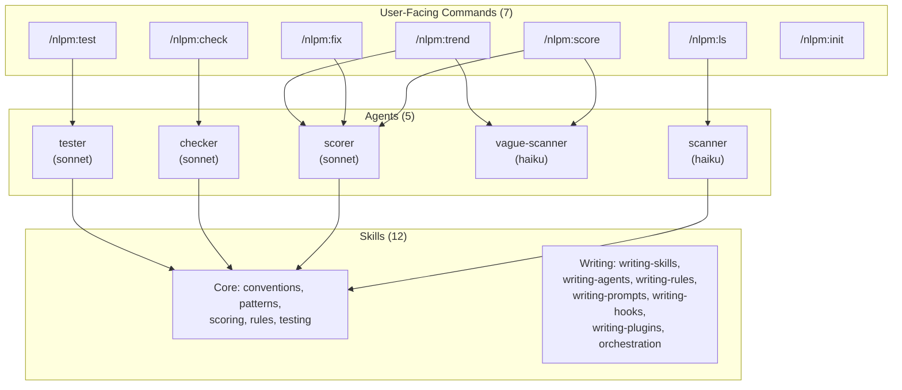
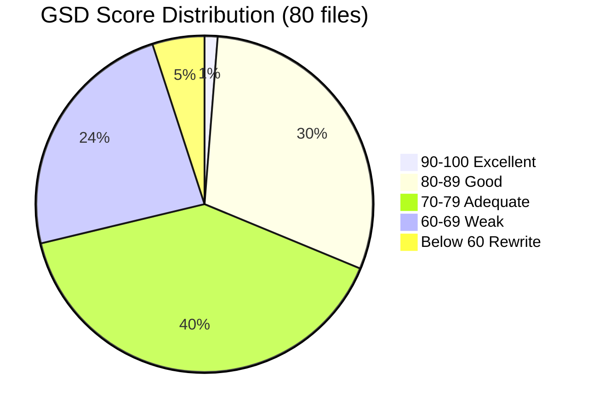
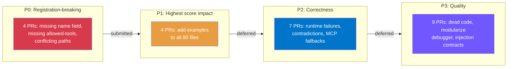
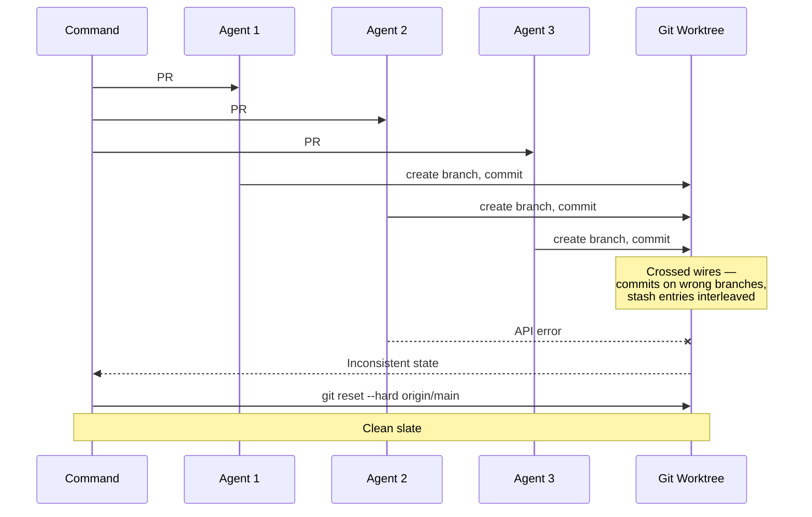
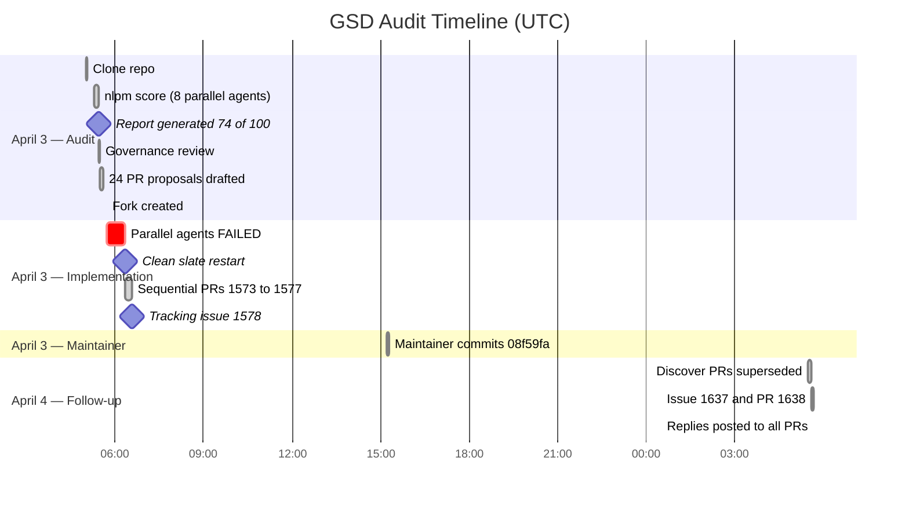

# When the Linter Met Its Match: Auditing a 48k-Star Project and Learning from the Diffs


> **Disclosure**: This article was drafted by Claude (Sonnet 4.6) based on session history from the engagement, then reviewed for factual accuracy against the GitHub record. The article describes Claude's own work auditing a third-party project using a tool (NLPM) built by the same author ([xiaolai](https://github.com/xiaolai)). Readers should weigh claims accordingly.

## The Project: get-shit-done (GSD)

[`gsd-build/get-shit-done`](https://github.com/gsd-build/get-shit-done) is a meta-prompting, context engineering, and spec-driven development system built for Claude Code by [TÂCHES](https://github.com/gsd-build). As of early April 2026 it had **48,053 GitHub stars** and **3,953 forks**, making it one of the most-starred Claude Code plugin repositories in existence.

The project's description: "A light-weight and powerful meta-prompting, context engineering and spec-driven development system for Claude Code."

In concrete terms, GSD is a framework of slash commands and subagents installed into Claude Code's `.claude/` directory. It gives Claude Code a structured workflow for software projects: planning phases, executing milestones, managing backlogs, profiling users, auditing security, generating documentation, and more. It ships with 21 agents and 59 commands — 80 natural language programming (NL) artifacts total. The commands include things like `/gsd:plan-phase`, `/gsd:execute-phase`, `/gsd:debug`, `/gsd:audit-milestone`, `/gsd:verify-work`, and `/gsd:autonomous`. The agents include specialists like `gsd-planner`, `gsd-executor`, `gsd-debugger`, `gsd-security-auditor`, and `gsd-user-profiler`.

The project uses JavaScript (CommonJS), enforces `node:test` (no Jest, no Mocha), and has CI with prompt injection scanning, base64 obfuscation scanning, and secret detection — an unusually security-conscious setup for an NL artifact project.

---

## How It Started

On April 3, 2026, xaiolai dropped a single message:

> `git@github.com:gsd-build/get-shit-done.git`  
> `clone it to ~/github/`

That was the entire brief — six words and a git URL, like handing someone a magnifying glass and pointing at a building. No instructions on what to look for, no scope set. The implication was clear enough.

The repo was cloned to `~/github/get-shit-done`. Then [NLPM](https://github.com/xiaolai/nlpm-for-claude) (Natural Language Programming Manager) was run against the entire repo.

---

## The Tool: NLPM — Natural Language Programming Manager

### Design Goal

NLPM starts from a single premise: **natural language artifacts are programs, and programs can be linted.**

Every Claude Code plugin is built from markdown files — commands, agents, skills, rules, hooks, CLAUDE.md. These files are not documentation. They are executable instructions that control AI behavior: what model to use, which tools to invoke, how to format output, when to block an action, what knowledge to load. A missing field in a command's YAML frontmatter is not a style issue — it is a registration failure. A vague instruction in an agent's body is not a readability concern — it is a nondeterministic behavior source.

Yet unlike JavaScript (ESLint), Python (ruff), or Rust (clippy), there was no linter for these artifacts. Authors wrote them by intuition, reviewed them by reading, and discovered defects the way you discover a hole in your umbrella — by getting rained on. NLPM exists to close that gap: apply the same systematic, repeatable, penalty-based quality analysis to NL artifacts that traditional linters apply to code.

### Core Insight: Natural Language Programs Have Deterministic Quality Properties

The key insight behind NLPM is that while natural language is inherently fuzzy, the *structural properties* of NL programming artifacts are not. A poem can be vague and beautiful; a YAML frontmatter field is either present or it isn't. Consider:

- A command either has a `name:` field or it doesn't. Without it, the runtime can't register the command. This is binary.
- An agent either declares its `tools:` list or it doesn't. Without it, tool access is undefined.
- A rule file either has a bold imperative opening or it doesn't. Without it, Claude is more likely to ignore the rule.
- A skill is either under 500 lines or it isn't. Over 500, it bloats the context window of every agent that loads it.

These checks produce the same answer every time. The score is deterministic: same artifact, same penalties, same number. There is no subjective "feel" adjustment.

Where judgment *is* required — "is this model tier appropriate for this task?", "is this vague word usage legitimate in context?" — NLPM labels the finding as **(heuristic)** in the report, so users know which assessments involved AI judgment versus mechanical pattern matching.

### Architecture

NLPM follows a strict **commands orchestrate agents, agents use skills** architecture:



Each layer has a distinct responsibility:

| Layer | Responsibility | Example |
|-------|---------------|---------|
| **Commands** | Parse user input, dispatch agents, format final output | `/nlpm:score agents/` parses the path, dispatches scorer + vague-scanner in parallel, merges results into a report |
| **Agents** | Perform analysis, apply judgment, produce structured findings | The scorer reads each file, applies the penalty rubric, and outputs a score table |
| **Skills** | Provide reference knowledge agents need to do their job | The scoring skill contains penalty tables; the conventions skill defines valid YAML schemas |

Commands never do analysis themselves. Agents never interact with the user. Skills are reference material, never imperative instructions. The separation is strict.

### The 50 Rules and Scoring

NLPM enforces 50 rules across 10 categories (Universal, Skills, Agents, Commands, Shared Partials, Rules, Hooks, CLAUDE.md, Prompts, Orchestration, Plugins). Each rule maps to a penalty in the scoring rubric. The scoring formula is simple: start at 100, subtract penalties for every issue found. No bonuses — like a building inspection, the score reflects what's not up to code, not how lovely the architecture looks.

| Range | Label | Meaning |
|-------|-------|---------|
| 90-100 | Excellent | Production-ready |
| 80-89 | Good | Minor gaps |
| 70-79 | Adequate | Meets threshold, should improve |
| 60-69 | Weak | Below threshold |
| <60 | Rewrite | Fundamental problems |

Default pass threshold: 70. Where judgment is required (e.g., "is this model tier appropriate?"), NLPM labels the finding as **(heuristic)** so users know which assessments involved AI reasoning versus mechanical checks.

### How a Score Run Works

1. **Discovery** (haiku): Glob for artifact patterns, classify by path, count lines.
2. **Parallel scoring**: The **vague-scanner** (haiku) counts flagged words mechanically; the **scorer** (sonnet) applies the full penalty rubric with heuristic judgment where needed.
3. **Merge**: Deterministic word counts from the vague-scanner override the scorer's own detection when they disagree.
4. **Report**: Per-file scores, ranked issue list, overall average.

The process is read-only — NLPM never modifies artifacts during scoring. A separate `/nlpm:fix` command handles repairs, and only mechanical fixes are applied automatically; judgment calls require user approval.

NLPM also provides cross-component checking (`/nlpm:check`) for reference integrity, orphan detection, and behavioral contradictions — and an NL-TDD system (`/nlpm:test`) for spec-driven development of NL artifacts. See the [NLPM repository](https://github.com/xiaolai/nlpm-for-claude) for full documentation.

---

## The Audit: 80 Files Scored in Parallel

NLPM (`nlpm:score`) was invoked with the repo root as argument. It discovered all 80 NL artifacts — 21 agents and 59 commands — and scored them in 8 parallel batches. The scoring criteria applied penalties for: missing/malformed YAML frontmatter, no output format specification, hollow delegation patterns, missing examples, vague qualifiers, and structural defects.

### Overall Score: 74/100 — ADEQUATE

The results by category:

| Type | Count | Avg Score | Min | Max |
|------|-------|-----------|-----|-----|
| Agent | 21 | 79.2 | 66 | 90 |
| Command | 59 | 72.4 | 48 | 86 |

Score distribution:



The valedictorian: `gsd-nyquist-auditor.md` at 90/100 — the only file to crack Excellent. The one that needed the most love: `commands/gsd/workstreams.md` at 48/100, missing its own name.

### Top Issues Found

| Priority | File | Issue | Score Impact |
|----------|------|-------|-------------|
| P0 | `commands/gsd/workstreams.md` | Missing `name:` field — non-canonical; may fall back to filename in some runtimes but breaks cross-runtime portability | -15 |
| P0 | `commands/gsd/reapply-patches.md` | Missing `name:` field + `allowed-tools` as scalar string instead of YAML list | -15 |
| P0* | `agents/gsd-ui-auditor.md` | `tools:` is a comma-separated scalar string, not a YAML list — schema portability concern | -10 |
| P0* | `agents/gsd-ui-checker.md` | Same — `tools:` scalar string | -10 |
| P0* | `agents/gsd-verifier.md` | Same — `tools:` scalar string | -10 |

\* *Note: scalar-string `tools:` fields (e.g., `tools: Read, Glob, Grep`) are accepted by Claude Code's parser and by GSD's own code. NLPM originally flagged these as defects, but this was an NLPM convention preference, not a runtime bug. NLPM v0.7.0 was subsequently updated to accept both formats. These items were correctly excluded from the PRs submitted.*
| P0 | `commands/gsd/review-backlog.md` | Step 3 uses `AskUserQuestion` but it's not in `allowed-tools` — runtime failure | -10 |
| P0 | `agents/gsd-user-profiler.md` | `@` import path conflicts with `<step>` path — profiling rubric may silently fail to load | -10 |
| P1 | `commands/gsd/cleanup.md` | Missing `allowed-tools` entirely — unrestricted tool access | -5 |
| P1 | `commands/gsd/help.md` | Same | -5 |
| P1 | `commands/gsd/join-discord.md` | Same | -5 |

Beyond the critical P0/P1 category:

- **78/80 files** had no `<examples>` block at all — the single highest-score improvement available (+10 pts each)
- **40/59 commands** used hollow wrapper patterns (100% delegation with zero inline logic)
- **35/59 commands** had no output format specification
- `gsd-debugger.md` was 1,380 lines with no modularization — loading philosophy and techniques on every invocation regardless of debug mode
- **21/21 agents** had no `<injection_contract>` documenting orchestrator-injected variables like `$PHASE_DIR`, `$PADDED_PHASE`, `$PHASE_NUM`
- **4 agents** referenced MCP tools (`mcp__context7__*`, `mcp__exa__*`, `mcp__firecrawl__*`) with no fallback if those servers were unavailable
- `gsd-roadmapper.md` had overlapping granularity ranges: Coarse 3-5, Standard 5-8, Fine 8-12 — with 5 and 8 each appearing in two ranges, making the rule non-deterministic

---

## The Plan: 24 PRs

After reviewing the repo's governance structure (CONTRIBUTING.md, issue templates, PR template, CI workflows), 24 PR proposals were drafted.



They were grouped by priority:

**P0 — Registration-breaking (PRs 1, 3, 4, 5):** Commands and agents that silently fail to load or execute.

**P1 — Highest score impact (PRs 7, 8, 9, 10):** Adding `<examples>` blocks to all 80 files — the single change that would move the overall average from ADEQUATE to GOOD.

**P2 — Correctness (PRs 2, 6, 11, 17, 20, 21, 22):** Runtime failures, contradictions, missing fallbacks, false negatives in the auth checker.

**P3 — Quality (PRs 12-16, 18, 19, 23, 24):** Dead code cleanup, modularization of the 1,380-line debugger, documenting injection contracts, replacing vague qualifiers with deterministic criteria.

---

## The Decision: Focus on the P0s

xaiolai reviewed the list and made a key scoping decision:

> "ignore all scalar string" (the P0 agents with tools as strings)  
> "OK, only propose pr for these issues."  
> "go ahead."

This narrowed the scope to the 5 most critical issues — the ones most likely to cause real user-facing failures. The reasoning: scalar-string `tools:` fields were in agents (which might work anyway depending on the parser's tolerance), while missing `name:` fields and missing `AskUserQuestion` in `allowed-tools` were definite runtime failures.

---

## First Attempt: Parallel Agents — A Mess



The first attempt used 5 parallel subagents, each assigned to one PR. What followed was the git equivalent of five chefs sharing one cutting board — commits ended up on wrong branches, stash entries interleaved, and the whole kitchen needed hosing down. Hard reset, clean slate, lesson learned.

---

## Second Attempt: Sequential, Direct — Clean

Each PR was executed directly in sequence: read target file, understand existing format, make minimal diff, commit, push to fork ([`xiaolai/get-shit-done`](https://github.com/xiaolai/get-shit-done)), create PR.

**[PR #1573](https://github.com/gsd-build/get-shit-done/pull/1573)** — `fix: add missing name field to workstreams and reapply-patches commands`

Added `name: gsd:workstreams` and `name: gsd:reapply-patches` to match the naming convention of all 57 other command files. Without `name:`, some Claude Code runtimes may fall back to the filename, but the explicit field ensures consistent registration across all environments — and every other command in the repo declared it.

**[PR #1574](https://github.com/gsd-build/get-shit-done/pull/1574)** — `fix: add AskUserQuestion to review-backlog allowed-tools`

`review-backlog.md` Step 3 explicitly calls for `AskUserQuestion` to present each backlog item to the user. But the tool wasn't listed in `allowed-tools`. The command would fail at exactly the moment it tried to prompt the user.

**[PR #1575](https://github.com/gsd-build/get-shit-done/pull/1575)** — `fix: resolve conflicting path references in gsd-user-profiler`

The agent's `<reference>` block used `@get-shit-done/references/user-profiling.md`. Its `<step name="load_rubric">` used `get-shit-done/references/user-profiling.md`. Neither matched the repo convention (`@~/.claude/get-shit-done/...`). If the runner couldn't resolve either format, the user profiling rubric would silently fail to load — the profiler would run with no actual rubric backing it.

**[PR #1576](https://github.com/gsd-build/get-shit-done/pull/1576)** — `fix: add missing allowed-tools to 4 commands`

Four commands (`cleanup.md`, `help.md`, `join-discord.md`, `workstreams.md`) had no `allowed-tools` field at all. Every other command in the repo declared an explicit tool set. Omitting the field grants unrestricted tool access — a principle-of-least-privilege violation. Each got a minimal, appropriate tool list: `[Read, Bash]` for commands that only delegate to `node "$GSD_TOOLS"`, `[]` for commands that produce pure text output.

**[PR #1577](https://github.com/gsd-build/get-shit-done/pull/1577)** — `fix: remove empty stub step in reapply-patches`

Step 5 of `reapply-patches.md` contained nothing but two bash comments:

```bash
# The manifest will be regenerated on next /gsd:update
# For now, just note which files were modified
```

The comments themselves admitted no work was being done. The step was removed and the remaining steps renumbered.

**[Issue #1578](https://github.com/gsd-build/get-shit-done/issues/1578)** — tracking issue documenting all 9 critical defects, the full audit methodology, and all 5 PRs.

All 5 PRs were submitted within approximately 15 minutes of the clean-slate restart (06:20 to 06:35 UTC, per GitHub timestamps). Sometimes the sequel is shorter than the blooper reel.

---

## The Maintainer's Response

The maintainer ([`trek-e`](https://github.com/trek-e), Tom Boucher) did not merge the PRs individually. Instead, he reviewed all five, agreed with all the diagnoses, and implemented a single commit ([`08f59fa`](https://github.com/gsd-build/get-shit-done/commit/08f59fabb4e89e42a28a852adb2073ebbff953d6)) that incorporated all the fixes simultaneously. The commit message confirmed acknowledgment:

```
fix(nlpm): resolve 5 critical defects from NLPM audit

- Add missing name: field to workstreams and reapply-patches commands
- Add AskUserQuestion to review-backlog allowed-tools
- Fix conflicting path references in gsd-user-profiler (use ~/.claude/get-shit-done/... convention)
- Add allowed-tools to cleanup, help, and join-discord commands
- Remove empty stub Step 5 from reapply-patches (dead bash comment block)

Closes #1578

Co-Authored-By: Claude Sonnet 4.6 <noreply@anthropic.com>
```

Notably: the `Co-Authored-By` line credits `Claude Sonnet 4.6` directly — a small line in a commit message, but a quiet acknowledgment that the diagnosis came from somewhere worth naming. All 5 PRs were closed as superseded by this commit, not merged separately.

---

## The Follow-Up: PR #1638

In the [#1576](https://github.com/gsd-build/get-shit-done/pull/1576) review, the maintainer noted a nuance: the locally-merged version had added `Write` to `workstreams.md`'s allowed-tools, but the PR's proposed set of `[Read, Bash]` was actually tighter and more accurate. The command only delegates to `node "$GSD_TOOLS"` via Bash — it never writes files directly.

A new issue ([#1637](https://github.com/gsd-build/get-shit-done/issues/1637)) was opened to document this. [PR #1638](https://github.com/gsd-build/get-shit-done/pull/1638) followed:

**[PR #1638](https://github.com/gsd-build/get-shit-done/pull/1638)** — `fix: remove unnecessary Write from workstreams allowed-tools`

Tightened `[Read, Write, Bash]` to `[Read, Bash]`. The maintainer had inadvertently introduced a broader-than-necessary tool surface in his consolidation commit.

However, [PR #1638](https://github.com/gsd-build/get-shit-done/pull/1638) was closed as a duplicate — the maintainer (or another contributor) had already submitted [PR #1642](https://github.com/gsd-build/get-shit-done/pull/1642) with the same fix, which was merged at 11:24 UTC on April 4. The issue was resolved, just not via our PR. In open source, it's perfectly fine to arrive second with the right answer — what matters is that the answer arrives.

Polite replies were posted to all 5 original PRs: acknowledging the superseding commit, thanking for the review, and noting the outstanding item from [#1576](https://github.com/gsd-build/get-shit-done/pull/1576).

---

## What the Audit Revealed About NL Artifact Quality at Scale

**A fairness note**: GSD is a fast-moving project maintained by a small team shipping rapidly across multiple runtime contexts. The defects found were the kind that accumulate naturally in any large NL artifact codebase under active development — they reflect the pace of iteration, not a lack of care. The maintainer's immediate, thorough response to the audit confirms the project's quality orientation. A 74/100 score passes NLPM's default threshold (70) and falls in the "adequate" band — functional, with room to improve.

The GSD audit exposed patterns that are likely universal in large NL artifact repos:

**Structural defects are rare but critical.** Only 5 files out of 80 had true registration-breaking issues — like a bridge with 80 bolts where 5 are missing. The bridge might hold, but you'd rather find out from an inspector than from the traffic. Users encountering `workstreams.md` or `reapply-patches.md` would see command-not-found errors with no indication of why.

**Missing examples are universal.** 78 of 80 files had zero `<examples>` blocks. This is the highest-leverage improvement available — each added example block is worth +10 points — but also the one requiring the most editorial work. There is no mechanical fix.

**Hollow delegation is rampant.** 40 of 59 commands were single-line delegations — like a receptionist who only says "ask the person down the hall." The command file tells you nothing about what actually happens; you have to follow the import chain to find the real logic.

**Least-privilege defaults are absent.** 4 commands had no `allowed-tools` field. The default behavior (unrestricted access) is exactly wrong for a security-conscious repo that runs prompt injection scans on every PR.

**Injection contracts are undocumented.** Every agent uses variables injected by the orchestrator (`$PHASE_DIR`, `$PADDED_PHASE`, `$PHASE_NUM`). None of them document the contract. A developer reading an agent to understand what it needs cannot learn that from the file itself — they have to find the orchestrator and reverse-engineer the injection.

**MCP fallbacks are absent.** 4 agents reference external MCP tools without any fallback for when those servers are unavailable. In any environment without those servers, the agents silently degrade.

---

## Timeline



Key timestamps with links:

- **06:31-06:35 UTC**: PRs [#1573](https://github.com/gsd-build/get-shit-done/pull/1573)-[#1577](https://github.com/gsd-build/get-shit-done/pull/1577) and issue [#1578](https://github.com/gsd-build/get-shit-done/issues/1578) created
- **15:12 UTC**: Maintainer commits [`08f59fa`](https://github.com/gsd-build/get-shit-done/commit/08f59fabb4e89e42a28a852adb2073ebbff953d6) — all fixes applied
- **April 4, 05:36 UTC**: [Issue #1637](https://github.com/gsd-build/get-shit-done/issues/1637) and [PR #1638](https://github.com/gsd-build/get-shit-done/pull/1638) submitted

---

## Key Technical Decisions

**Decision: Focus only on P0 structural failures, not the full 24-PR plan.**

Rationale: The scalar-string `tools:` fields in 3 agents might be tolerated by lenient YAML parsers — the real failures were guaranteed to be the missing `name:` fields and the `AskUserQuestion` omission. Limiting scope to 5 PRs made the contribution manageable and review-friendly, given the repo's `CODEOWNERS` requiring maintainer sign-off on everything.

**Decision: Sequential implementation after parallel agent failure.**

Rationale: The parallel approach created a corrupted state (branches with mixed commits, stash entries from multiple agents). The cleanup and redo was faster than trying to untangle the mess. The lesson: for changes that touch the same files across branches, parallel agents create race conditions on the working tree.

**Decision: Post a tracking issue alongside the PRs.**

Rationale: The maintainer needed context. Five small PRs with no explanation of the audit methodology would look arbitrary. The tracking issue [#1578](https://github.com/gsd-build/get-shit-done/issues/1578) gave the full picture — what tool was used, what methodology, all 9 critical issues, a priority matrix — and let the maintainer make informed decisions about which PRs to prioritize and which to defer.

**Decision: Follow up with [PR #1638](https://github.com/gsd-build/get-shit-done/pull/1638) based on maintainer feedback.**

Rationale: The maintainer caught a real nuance in his own consolidation commit — he'd added `Write` unnecessarily. Accepting that feedback and submitting the correction demonstrated good-faith collaboration and produced a strictly better outcome than either the original proposal or the maintainer's own fix.

---

## What Was Built vs. What Was Fixed

This engagement was not about building new features. It was about systematic quality assurance of an existing NL artifact ecosystem using NLPM — a framework for treating natural language programming artifacts (prompts, agents, commands, skills, rules) as first-class software that can be scored, audited, and improved with the same rigor as code.

What was delivered:
- A complete NLPM audit report of 80 files with per-file scores, issue lists, and a priority matrix
- 5 structural fix PRs submitted ([#1573](https://github.com/gsd-build/get-shit-done/pull/1573)-[#1577](https://github.com/gsd-build/get-shit-done/pull/1577)), all diagnoses confirmed by the maintainer
- 1 follow-up PR ([#1638](https://github.com/gsd-build/get-shit-done/pull/1638)), closed as duplicate — the same fix landed via [#1642](https://github.com/gsd-build/get-shit-done/pull/1642)
- A tracking issue ([#1578](https://github.com/gsd-build/get-shit-done/issues/1578)) documenting the full audit
- All 5 original fixes incorporated into main via the maintainer's consolidation commit, credited to Claude Code

What was surfaced but deferred:
- 19 more PRs addressing quality, documentation, and refactoring concerns
- The universal absence of `<examples>` blocks (the highest-ROI improvement)
- Modularization of `gsd-debugger.md` (1,380 lines)
- Injection contracts and structured trigger blocks for all 21 agents
- MCP fallback chains for research agents

The deferred work represents the delta between "adequate" (74/100) and "excellent" (90+). The critical fixes delivered brought the repo from having silent runtime failures to having clean registration, correct tool access declarations, and consistent path resolution.

---

## Limitations

This engagement validated NLPM against one project. It does not prove the methodology generalizes across all NL artifact codebases. Specific caveats:

- **No runtime reproduction**: The structural defects (missing `name:`, missing `allowed-tools`) were identified by static analysis. We did not reproduce runtime failures in GSD's actual execution environment. Claude Code may tolerate some of these through fallback behavior.
- **NLPM's rules are opinionated**: Several findings (hollow delegation, missing examples, undocumented injection contracts) reflect NLPM's quality model, not universal standards. Reasonable developers can disagree on whether these are defects or acceptable trade-offs for rapid iteration.
- **No post-fix scoring**: The repo was not re-scored after the fixes landed. We cannot quantify the score improvement.
- **Sample size of one**: Patterns identified ("missing examples are universal", "least-privilege defaults are absent") are observed in one project. They may not generalize.

---

## Significance

GSD is one of the most actively maintained Claude Code frameworks in the ecosystem. The five structural fixes addressed real consistency issues in a codebase that 48k users rely on. Whether these would have manifested as user-facing failures depends on the specific runtime and parser — but the maintainer reviewed each diagnosis, agreed with all five, and incorporated them into the project.

The maintainer's commit message credited `Claude Sonnet 4.6` as co-author — an acknowledgment that the contribution was treated as substantive, not noise.

For NLPM, the experience was a mirror as much as a microscope. The tool found genuine structural defects (confirmed by the maintainer), but also flagged convention preferences as bugs (scalar-string `tools:` fields). That false-positive led directly to NLPM v0.7.0 updating its own rules to accept both formats. There is a gentle irony in a linter that goes out to audit someone else's code and comes home with homework of its own — but perhaps that is exactly how tools ought to grow.
